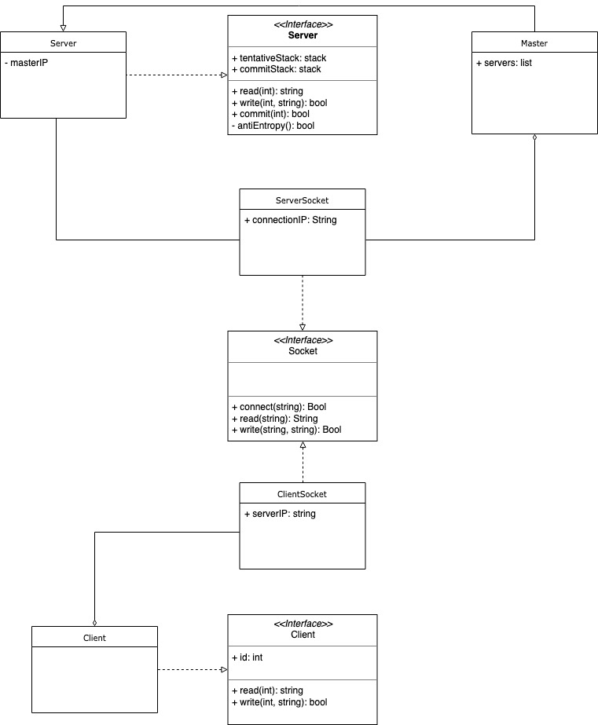
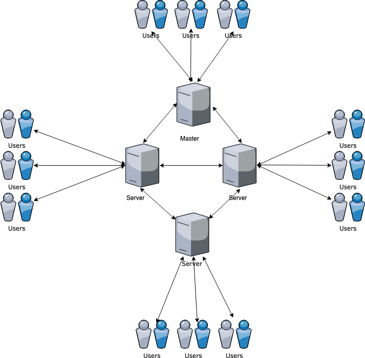

# Table of Contents

1.  [Bayou system scope and model](#org9c37da1)
    1.  [UML](#org2660ba2)
    2.  [Network](#orgdde8520)


<a id="org9c37da1"></a>

# Bayou system scope and model

Bayou is a weakly consistent storage system. It is designed with mobile computing in mind. The ability to update your data anywhere is paramount in this use case scenario. Bayou
consist of three main components, namely: server, client, and master. The servers each contain the data collection in full. The master is simply a server that has a special privelige.
Clients interact with the servers through the Bayou API, that is implemented as a stub bound together with a specific application.


<a id="org2660ba2"></a>

## UML



This UML diagram displays the various components of the Bayou system.
The Server interface is implemented by both the server and the master.
The Client interface is implemented by the client.
The Socket interface is implemented by the ServerSocket and ClientSocket, these sockets are used for server-server and client-server communication.
The `tentativeStack` and `committedStack` fields are where writes are stored.
The `read` methods of all entities are passed an id as argument and return the wanted string to read as result.
The `write` methods of all entities include the important dependency check, update function, and merge procedures that make Bayou what it is. These are customed per application and if wanted per write.
The `commit` method represents the ability to move written data from the tentative to the committed stack.
The `anti-entropy` method effectuates the ordering of stacks in the network.


<a id="orgdde8520"></a>

## Network



This diagram visualizes an abstract representation of the Bayou network
In the Bayou system all servers contain a full replica of the data collection. Clients interact with the servers through the Bayou API, that is realized as a stub bound to a
client application. The master is the only server that can move writes from the tentative to the committed stack without needing a anti-entropy session. These updates are
then propagated through the network by employing anti-entropy session between two servers and server and client.

## Experiments

The experiments can be generated using the sh files in the experiments folder:
```sh
./create_compose_chain.sh [NR_OF_SLAVES]
```

After this, the experiment can be started by starting all processes from the generated docker-compose.yml file and output the output to a log file:
```sh
docker-compose up |tee log-file.txt
```
