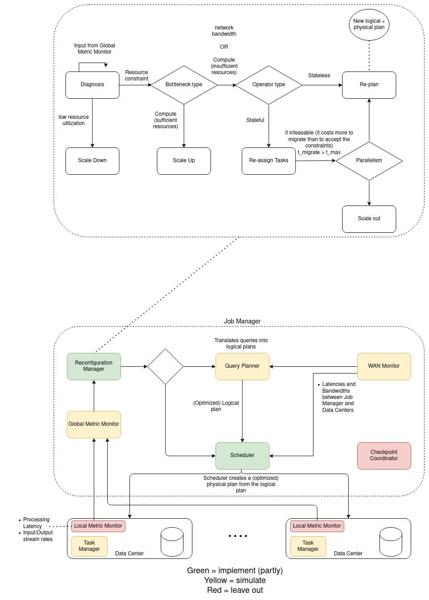

# WASP Implementation

## Design

The design is based on expanding Apache Flink [[1]](#1) with parts of the optimizations presented in WASP [[2]](#2). A visual representation of the full WASP implementation is depicted below, with components that we are implementing in green, components that we are simulating in yellow, and components that we are not implementing as red.

Adaptations of Apache Flink:
 - adapt task scheduler with scheduling algorithm of WASP, explained below

Gurobi Optimization Tool [[3]](#3) to solve ILP problem:
 - Run it when the reconfiguration manager reports problem

Simulate Global Monitor and WAN Monitor (Bandwidth, latency, available task slots, expected output rate, etc ...)

Healthy execution:
- Processing rate equal to input rate (sufficient computational power)
- Input rate equal to expected input rate (sufficient bandwidth)

### Functional Requirements

* The system should be able to identify the bottlenecks and take the appropriate actions as mentioned below.
    * Reconfiguration due to computational resources - If the computational resources are the bottleneck for a particular operator, the algorithm should first attempt to scale up (increase resources within the same site), and then scale out (distribute the workload on a greater number of sites). On the other hand, if excess resources are allocated to an operator, the algorithm should scale down.
    * Reconfiguration due to bandwidth/latency - If the upstream bandwidth of a particular node is the bottleneck, the upstream node should limit the stream sent to that node. The plan should be restructured to utilize links with higher bandwidths.
* Reconfiguration should be possible, not only at the start of each execution, but also when the execution is in progress.

### Non-Functional Requirements

* Data quality - No data degradation (no throwing away parts of the stream if it cannot be processed fast enough or sacrificing accuracy, only as last resort).
* Streaming Data - The system should handle data that continuously flows to it at different speeds
* Scalability - Nodes shall utilize resources within a certain boundary (not going above or below a certain threshold). Parallelism can be increased by scaling up/out the operators
* Distribution - Distributing tasks to be processed amongst different machines on multiple data centers
* Processing Guarantees - The submitted query shall be executed, and the result retrieved within a certain finite amount of time.
* Flow Control - The system should be able to handle effectively the nodes work overload

## Benchmark

Baseline is the scheduler without reconfiguring any of the task placements after the initial schedule vs. WASP reconfiguring task placement based on collected metrics from the data centers.

Running the Yahoo Streaming Benchmark (YSB) with real world traces such as facebook or twitter.

## References 

<a id="1">[1]</a>
The Apache Software Foundation. Apache Flink. DOI:https://flink.apache.org/ 

<a id="2">[2]</a>
Albert Jonathan, Abhishek Chandra, and Jon Weissman. 2020. WASP: Wide-area Adaptive Stream Processing. In Proceedings of the 21st International Middleware Conference (Middleware '20). Association for Computing Machinery, New York, NY, USA, 221–235. DOI:https://doi-org.tudelft.idm.oclc.org/10.1145/3423211.3425668

<a id="3">[3]</a>
Gurobi Optimization, LLC. Gurobi Optimization Tool. 2021. DOI:http://www.gurobi.com