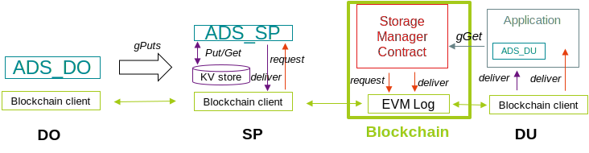

# SGRuB

This project features a partial implementation of "GRuB", from [_Cost-Effective Data Feeds to Blockchains via Workload-Adaptive Data Replication_](https://dl.acm.org/doi/abs/10.1145/3423211.3425696), in Scala.

There are separate README files in the src and experiments folders, explaining how to set up both the project itself and run experiments.

# Publish project to local repository before running experiments

In the `src` folder, run `sbt publishLocal`.