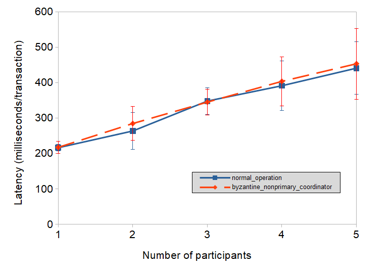

## Introduction

In the past weeks we have implemented the system described in *"A Byzantine Fault Tolerant Distributed Commit Protocol"* by Wenbing Zhao[^1].

In the paper the author describes a commit protocol for transactions which run over untrusted networks.
The Two Phase Commit (2PC) protocol addresses the issue of implementing a distributed commit protocol for distributed transactions, and different approaches have been conducted in order to make it support byzantine behaviours.
The main idea of the byzantine-commit-protocol is the replication of the coordinator and running a Byzantine agreement algorithm among the replicas.
This protocol tolerates byzantine coordinator and limited faulty participant behaviour.

[^1]: "A Byzantine Fault Tolerant Distributed Commit Protocol" by Wenbing Zhao (Department of Electrical and Computer Engineering, Cleveland State University), <https://ieeexplore.ieee.org/document/4351387>

## Objectives

We set objectives from the beginning in order to figure out and organise the work that had to be done.
The objective list was divided into categories to state the priority of each objective.

- **Must have:** features the project must have in order to fulfill the basic requirements.
  - Implementation for coordinators.
  - Implementation for participants/initiators.
  - System testing infrastructure, including coordinator byzantine behaviours testing.

- **Should have/Could have**: features that might be implemented depending on time constraints.
  - Distributed deployment: test the system in multiple interconnected machines to simulate a realistic environment.
  - Message signing and signature checking.

- **Could have/Will not have**:
  - View change mechanism (this feature was not implemented by the paper authors either).

## The Protocol

### Byzantine Fault Tolerance - Why

There are multiple reasons to choose a byzantine fault tolerant distributed commit protocol.

In the basic 2PC protocol, a single coordinator is responsible for multiple participants.
The coordinator is trusted by the participants and represents a single point of failure.
If the coordinator expresses byzantine behaviour, for example by telling one participant to commit and another to abort, the participants will trust the coordinator and therefore do as it says.
This would then lead to the participants having different views on what transactions are done, which defeats the purpose of the protocol to reach an agreement.

That is the main problem the byzantine fault tolerant commit protocol solves.
It can handle compromised/byzantine coordinators that for example sends different messages to different participants.
Another problem the byzantine fault tolerant commit protocol solves is that it's able to continue working even if some coordinators fail or become unavailable.
Compare this with the 2PC protocol where the protocol would stop working if the coordinator stops working.
Thus it improves the availability of the system compared to 2PC.
Since the protocol introduces multiple coordinators, it becomes possible for the participant to send different messages to the coordinators.
The authors have thought of this and made sure that the protocol detects and handles this.

### Distributed commit protocol

In the distributed commit protocol presented in the paper the author address the problem of a byzantine coordinator by replicating the coordinator.
One of these replicas is the primary.
The resulting system works correctly so long as it has $3f+1$ coordinator replicas where at most *f* coordinators are byzantine.

One of the participants, which we call initiator, initiates a transaction.
This initiator is responsible for propagating the transaction to the other participants that are part of the transaction.
Then the participants register with the coordinators.
The protocol starts when the initiator has received confirmation from all participants, that they have registered with $2f+1$ coordinators, and then sends a initiate commit request message to all coordinators.

The coordinators then sends a prepare message to all registered participants.
The participants answer whether they can commit.
If any of them could not prepare successfully, an abort will take place, otherwise the protocol proceeds.

The coordinators continue by creating an instance of the *Byzantine Agreement Algorithm*, where an agreement is attempted on both which participants are taking part in the transaction as well as the votes of the participants.
This is described in more detail in the ["Byzantine Agreement Algorithm" section](#byzantine-agreement-algorithm).

After reaching an agreement, coordinator replicas send the agreement outcome to participants, which will only commit the transaction once $f+1$ similar outcomes are received, to ensure that they reject the answer of byzantine coordinators.
Since the protocol allows up to $f$ byzantine coordinators, when $f+1$ messages are received by the participants (including the initiator, which is a participant), they can be sure that at least one message is from a non-byzantine coordinator.

{#fig:examplevoting width=75%}

### Byzantine Agreement Algorithm

Wenbing Zhao's algorithm is based on the BFT algorithm by Castro and Liskov.
While the aim of the BFT algorithm is designed to make an agreement on the ordering of the requests received, the Byzantine Agreement Algorithm's objective is to agree on the outcome of a transaction.
Byzantine Agreement Algorithm has three phases:

- **Ba-pre-prepare phase**: In this phase the primary sends a *ba-pre-prepare* message to all other replicas.
  The *ba-pre-prepare* message contains the following information: view id, transaction id, transaction outcome and decision certificate.
  The decision certificate is a collection of records of each participant's registration and vote for every transaction.
  A new view is requested and created if the *ba-pre-prepare* message fails any verification (signed by the primary, coherent transaction and view and has not accepted a *ba-pre-prepare* in this view-transaction).

- **Ba-prepare phase**:
  Once a replica has ba-pre-prepared it multicasts a *ba-prepare* message to all other replicas.
  A *ba-prepare* message contains the view id, transaction id, digested decision certificate, transaction outcome and replica id $i$.
  The message is accepted if it is correctly signed by replica $i$, the receiving replica's view and transaction id match message view and transaction's id, message's transaction outcome matches receiving replica transaction outcome and decision certificate's digest matches the local decision certificate.
  When a replica collects $2f$ matching *ba-prepare* messages from different replicas it can make a decision for the current transaction and sends a *ba-commit* message to all other replicas.

- **Ba-commit phase**:
  A *ba-commit* message contains the view and transaction id, decision certificate's digest, transaction outcome and sender replica id.
  A replica is said to have ba-committed if it receives $2f+1$ matching *ba-commit* messages from different replicas and the agreed outcome is sent to every participant in the current transaction.
  *Ba-commit* messages are verified alike *ba-prepare* messages.

### Thoughts on the paper

Although the paper is mostly written in a clear and concise manner, some parts seems to be lacking and not fully clear to us.

The decision certificate contains a list of votes and registrations, both signed by the sender.
While the signature for the registration contains the sender, the signature of the vote does not.
We assume that this is a typo in the paper.

> Furthermore, we assume that a correct participant *registers with $f+1$ or more correct coordinator replicas* before it sends a reply to the initiator when the transaction is propagated to this participant with a request coming from the initiator. (p.39)

vs.

> Because the participant p is correct and responded to the initiator's request properly, it must have "registered with at least $2f+1$ coordinator replicas" prior to sending its reply to the initiator. (p.42)

The number of registrations is the *same* as the first specifically mentions *correct* coordinator replicas.
Therefore the participant actually has to register with f more replicas.

Initially it was not clear that the initiator propagates the transaction to all participants, as the Introduction specifically mentions the participants-have-to-know-all-other-participants as a drawback of another protocol.

> A backup suspects the primary and initiates a view change immediately if the ba-pre-prepare message fails the verification

Shouldn't the view-changes be voted on?

> When the primary for view $v+1$ receives $2f+1$ valid view change messages [...], it [...] multicasts a new view message for view $v+1$.

What if the new primary is byzantine (and does not send out the new view), how is it guaranteed that another replica takes over to view $v+2$?

Pseudo-code: The paper never mentions if the functions are thought to be executed on coordinator or participant side.

## Design Decisions

We have used the **Akka** framework, which is based on Scala, to implement coordinators and participants as actors since it simplifies distributed and concurrent application development.
Actors communicate with each other through messages using the **Akka API**.

We decided to use **Akka** since it proved a actor framework that could be used to avoid implementing the sending of messages.

As we're implementing a commit protocol which is based on messages, it makes sense to use a framework for passing messages.

As we are restricted to Scala and **Akka** seems to be one of the most-used frameworks (actor framework) for that purpose, we chose to use that.

We created two typed of actors, coordinators and participants.
From the tests we created we initialize a couple of coordinators and participants (depending on the test case) and send a initialization message from one of the participants (the initiator) to the coordinators.
After that the protocol starts.

## Implementation Details

### Message signing

These messages are signed using public key technology so that no unidentified participant can interfere.

The signing is implemented using a master certificate that signs all the individual certificates (of the coordinators and participants).

It is currently not checked whether the message originates (with regards to the from-field) from the same actor as it is signed by (spoofing is still possible).

### Shortcomings

In the original paper, view changes were not implemented.
We considered implementing these, but ultimately set other priorities.
The system has also not been ran in a distributed fashion.

The idea to get our implementation running in a distributed fashion is:

- Manually start **Akka Actors** in different JVMs (could be on the same or on different PCs)
- Get the actors to communicate with each other using Artery (serialization of messages, actor discovery)
- Key distribution might be hard, disable the checks in code

## Evaluation

### Functional requirements

Functional requirements were evaluated using the **Akka Actor Test Kit** with **Scala Tests** (```ScalaTestWithActorTestKit```).
We considered:

- Basic Committing
- Aborting
- Unilateral aborting
- Byzantine behavior tolerance

Along with the development we have built a set of tests which tested every feature we implemented.
This way we ensured that every module did its work properly.

We have built a total of 17 tests through which coordinators and participants exchange messages and perform the corresponding message verification and decision making processes.
These tests ensure the implementation correctness by creating protocol instances and making coordinator replicas and participants conduct several distributed commit protocols.
A different number of transactions, coordinator replicas and participants is used to test the system's resilience to multiple message passing.
The ability to abort a transaction was also tested.

The following tests were implemented:

- **Test 1:** Run with 1 coordinator replica and 1 participant, resulting in a commit.

- **Test 2:** Run with 4 coordinator replicas and 1 participant, resulting in a commit.

- **Test 3:** Run with 1 coordinator replica and 4 participants, resulting in a commit.

- **Test 4:** Run with 1 coordinator replica and 1 participant and have the participant unilaterally abort the transaction, resulting in an abort.

- **Test 5:** Run with 1 coordinator replica and 4 participants and have one participant unilaterally abort the transaction, resulting in an abort.

- **Test 6:** Run with 4 coordinator replicas and 4 participants and have one participant unilaterally abort the transaction, resulting in an abort.

- **Test 7:** Run with 1 coordinator replica and 1 participant and have the initiator abort the transaction, resulting in an abort.

- **Test 8:** Run with 4 coordinator replicas and 1 participant and have the initiator abort the transaction, resulting in an abort.

- **Test 9:** Run with 1 coordinator replica and 4 participants and have the initiator abort the transaction, resulting in an abort.

- **Test 10:** Run 2 instances of the protocol, both resulting in a commit.

- **Test 11:** Run with 4 coordinator replicas (of which 1 is nonresponsive) and 1 participant, resulting in a commit.

- **Test 12:** Run with 4 coordinator replicas (of which 1 is nonresponsive) and 1 participant and have the initiator abort, resulting in an abort.

- **Test 13:** Run with 4 coordinator replicas (of which 1 non-primary exhibits some byzantine behaviour) and 1 participant, resulting in a commit.

- **Test 14:** Run with 4 coordinator replicas (of which 1 non-primary exhibits some byzantine behaviour) and 1 participant and have the initiator abort, resulting in an abort.

- **Test 15:** Run with 4 coordinator replicas (of which the primary exhibits some byzantine behaviour) and 1 participant, resulting in a commit.

- **Test 16:** Run with 4 coordinator replicas (of which the primary exhibits some byzantine behaviour) and 1 participant and have the initiator abort, resulting in an abort.

- **Test 17:** Run with 1 participant and 1 slow coordinator which will exceed the timeout, resulting in a view change being suggested.

Tests 1 through 14 succeed as expected.
Tests 15 and 16 fail, since the solution to a byzantine primary coordinator replica is to perform a view change, which has not been implemented.
Test 17 requires only that the need for a view change is detected, not that it is actually performed.
Hence it also succeeds as described.

### Non-Functional Requirements

All tests were performed with 4 coordinators.
The tests were carried out on a laptop with an Intel i3-5005U (dual-core operating at a fixed 2.0 GHz) with 8 GB of RAM.

The latency was measured both with normal behaving nodes and with a single byzantine non-primary coordinator replica.
If a non-primary coordinator replica is byzantine, a small performance reduction could occur since the algorithm might have to depend on other replicas to reach consensus.

The test consisted of starting a new transaction once the previous had committed, until 100 commits had been completed.
The average latency of such a test constitutes one sample.
50 such samples were collected for each test configuration.

*@fig:evaluationchart1 shows the latency measured in these test.
The error bars indicate 2 standard deviations, based on the variance between samples of 100 commits, not between the individual commits.
The variance between individual commits is expected to be larger.

No performance difference could be discerned.
This might be related to the observation that actors would often be running sequentially due to limited parallelism, which limited the benefit of early consensus.

{#fig:evaluationchart1 width=75%}

## Discussion

The main challenge of the project was to understand who the system was supposed to work.
It was not very clear from the original paper that the system was very heavily depending on the WS-AT protocol, and that it therefore was crucial to understand it before understanding the byzantine fault tolerant distributed commit protocol.
The coronavirus situation also made it necessary for three of us to return to our home countries urgently, that led us to loose some time in the last few weeks of the project, which we could not fully recover in the extra week we got, since the new courses had started then.

One of our team members, Miguel Lucas, was responsible for testing the system in a distributed fashion, but due to the coronavirus situation he had to return to his country and finish his studies at his home university.
For this reason, he could not work on the project any more so the system could not be tested in a distributed fashion.

## Future Work

- Expanding the simulation of byzantine behaviour.
  The current implementation of byzantine behaviour only covers a fraction of the byzantine faulty space.
  Expanding this could be interesting, but simulating more byzantine behaviours would have a large impact on code complexity.
  Ultimately, we believe simulating all possible byzantine behaviours is impossible.
  If we simulate anything less, we can only prove the system is not byzantine fault tolerant, not that it is.
- Running the system in a distributed manner: actors on different hosts should be able to communicate with each other.
- Implementing view changes.

## Conclusion

To sum up, we managed to implement the protocol to the same extent as the paper, so not including view changes.
The ability to tolerate some byzantine behaviour of a non-primary coordinator replica has been demonstrated.
It has also been shown that the presence of this byzantine coordinator replica this does not affect the performance when tested in operation on a single machine.
